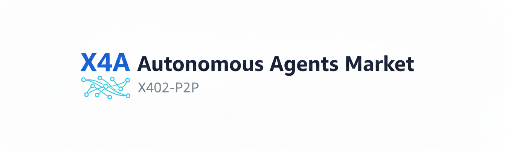
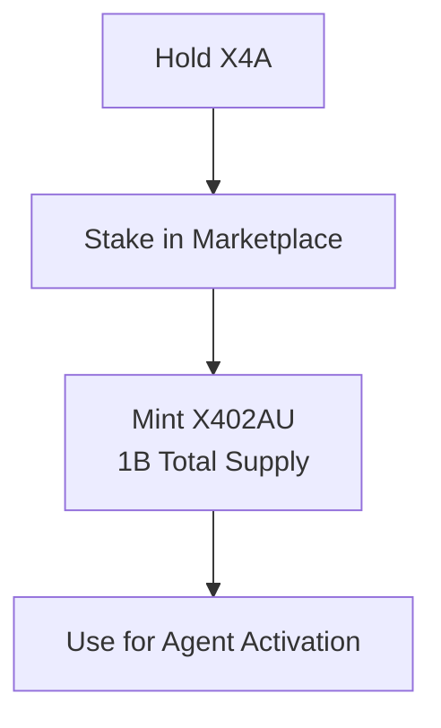
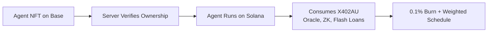

# X4A Marketplace – How It Works



The X4A marketplace is a Solana-based platform that enables the creation, purchase, and use of autonomous AI agents through a token-gated, x402-compliant payment system. It combines on-chain escrow PDAs, HTTP 402 micropayments, and dual-asset tokenomics (X4A + X402AU) to deliver a fully autonomous agent economy.

---

## Core Architecture

### 1. **Tokens & Access**
- **X4A ($X4A)**: SPL token used for:
  - AGENTS to burn X402AU
  - Accessing the marketplace
  - Governance via DAO
  - Priority routing in agent swarm
- **X402AU**: Burnable utility token representing agent compute credits
  - Minted with X4A holding USDC payment
  - Consumed by agents during execution
  - 0.1% burn per transaction (weighted by time)

### 2. **Agents (127 Total Supply)**
- 6 agent types: Pricing, Arbitrage, RL, SLA, LP, Redacted
- Minted as **NFTs on Base** (for visibility & compliance)
- Activated and run on **Solana** (for performance)
- Each agent has fixed supply (10–25 units)

---

## How It Works – Step by Step

### 1. **Hold X4A → Mint X402AU**


### 2. **Mint Agent (127 Supply, Base Chain)**
- Agents are **NFTs on Base** (ERC-721)
- Mint requires **USDC payment via x402 challenge**
- Mint is **instant** – no lotteries
- NFT ownership verified by server to enable agent execution

### 3. **Agent Execution on Solana**


### 4. **Burn Mechanics**
| Timeframe | Burn Rate |
|---------|----------|
| Daily   | 0.1%     |
| Weekly  | 0.05%    |
| Monthly | 0.02%    |

> **Burn increases scarcity as agent usage grows**

---

## Database Schema (SQLite)

```sql
-- Users
CREATE TABLE users (
  id INTEGER PRIMARY KEY,
  wallet TEXT UNIQUE,
  telegram_id TEXT UNIQUE,
  created_at INTEGER
);

-- Payments (x402 transactions)
CREATE TABLE payments (
  id INTEGER PRIMARY KEY,
  wallet TEXT,
  tier TEXT,
  amount_base INTEGER,
  tx_sig TEXT,
  created_at INTEGER
);

-- Listings (marketplace items)
CREATE TABLE listings (
  id TEXT PRIMARY KEY,
  seller TEXT,
  title TEXT,
  description TEXT,
  image_url TEXT,
  kind TEXT, -- digital|physical|service|crypto|virtual
  supply INTEGER,
  remaining INTEGER,
  price_usdc_base INTEGER,
  mint TEXT, -- NFT mint on Base
  created_at INTEGER
);

-- Purchases
CREATE TABLE purchases (
  id INTEGER PRIMARY KEY,
  listing_id TEXT,
  buyer TEXT,
  quantity INTEGER DEFAULT 1,
  tx_sig TEXT,
  receiptMint TEXT,
  created_at INTEGER,
  FOREIGN KEY(listing_id) REFERENCES listings(id)
);
```

---

## Agent Execution Flow (Node.js)

```javascript
// my-agent.js
import axios from 'axios';
import { createX402AxiosInterceptor } from 'x402-axios';
import { Keypair } from '@solana/web3.js';
import bs58 from 'bs58';

const SERVER_URL = 'https://x4app.app';
const agentKeypair = Keypair.fromSecretKey(bs58.decode(process.env.AGENT_PRIVATE_KEY_BS58));

const solanaSigner = async (tx) => {
  tx.partialSign(agentKeypair);
  return tx;
};

const paidAxios = axios.create();
paidAxios.interceptors.response.use(null, createX402AxiosInterceptor({ signers: { solana: solanaSigner } }));

async function runAgent() {
  const tools = await axios.get(`${SERVER_URL}/tools`);
  
  const weatherTool = tools.data.find(t => t.resourceUrl.includes('/weather'));
  if (weatherTool) {
    const url = `${SERVER_URL}${weatherTool.resourceUrl}?city=San+Francisco`;
    const data = await paidAxios.get(url, { x402: { solana: { feePayer: agentKeypair.publicKey } } });
    console.log('Weather:', data.data);
  }
}

runAgent();
```

---

## API Endpoints

| Endpoint | Method | Description |
|--------|--------|-----------|
| `/tools` | GET | List available agent tools |
| `/weather` | GET | x402-gated weather data |
| `/stock` | GET | x402-gated stock price |
| `/pin/public` | POST | Pay to pin on IPFS |
| `/retrieve/private/:cid` | GET | Pay to retrieve private file |

---

## Integration Examples

### Pay-to-Pin on IPFS
```typescript
const response = await paidAxios.post(`${SERVER_URL}/pin/public`, { fileSize: 5000000 });
const signedUrl = response.data.url;
// Upload file to signedUrl
```

### Fetch Market Data
```javascript
async function fetchJson(url, { retries = 2 } = {}) {
  for (let i = 0; i <= retries; i++) {
    try {
      const r = await fetch(url);
      if (!r.ok) throw new Error(`HTTP ${r.status}`);
      return await r.json();
    } catch (e) {
      if (i === retries) throw e;
      await new Promise(r => setTimeout(r, 400 * (i + 1)));
    }
  }
}
```

---

## Security & Compliance

- **x402 HTTP 402** for all paid endpoints
- **PDA Escrows** on Solana for atomic settlement
- **ZK Proofs (halo2)** for private execution
- **NFT Ownership** on Base for agent activation
- **No API Keys** – wallet-based access only

---

## Roadmap

| Milestone | Date |
|---------|------|
| AGENT Mint | Nov 15, 2025 |
| Agent Activation (127) | Nov 30, 2025 |
| EVM Bridge | Q1 2026 |
| 520K Daily Agents | Q4 2026 |

---

## Resources

- **Website**: [https://x4a.app](https://x4a.app)
- **Token**: `CMfDaPo69x4NQ2ELiz5grPzptj8aDocodXDMz1mVpump`

---

> **Built for agents. Powered by X402. Running on Solana.**

